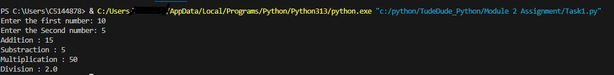
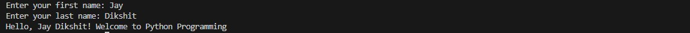

# TuteDude Assignment 1  
**Module 2: Basic Python Concepts**

This repository contains solutions for **Assignment 1** of the TudeDude course.  
It covers two basic Python tasks focusing on mathematical operations and string manipulation.

---

## 📂 Repository Contents

- `task1.py` → Python script to perform basic mathematical operations  
- `task2.py` → Python script to generate a personalized greeting  
- `task1_output` → Output file for Task 1  
- `task2_output` → Output file for Task 2  
- `README.md` → Project documentation  

---

## 📝 Tasks Overview

### **Task 1: Perform Basic Mathematical Operations**
**Problem Statement:**  
Write a Python program that:
1. Takes two numbers as input from the user.
2. Performs:
   - Addition  
   - Subtraction  
   - Multiplication  
   - Division  
3. Displays the results on the screen.

**Expected Output Example:**

Enter first number: 10
Enter second number: 5

Addition: 15
Subtraction: 5
Multiplication: 50
Division: 2.0

---

### **Task 2: Create a Personalized Greeting**
**Problem Statement:**  
Write a Python program that:
1. Takes a user's **first name** and **last name** as input.
2. Concatenates them into a full name.
3. Prints a personalized greeting.

**Expected Output Example:**
Enter your first name: Jay
Enter your last name: Dikshit

Hello, Jay Dikshit! Welcome to Python Programming 🚀

## 🖼️ Screenshots / Output Images

### Task 1 Output

### Task 2 Output

