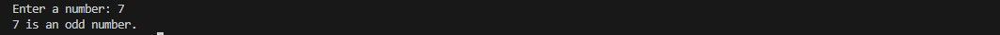
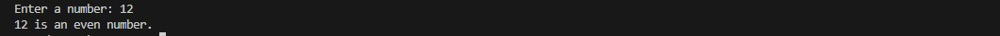
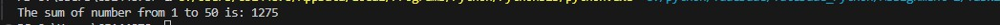

# TudeDude Assignment 2  
**Module 3: Control Structures in Python**

This repository contains solutions for **Assignment 2** of the TudeDude course.  
It focuses on applying control structures in Python through conditional statements and loops.

---

## 📂 Repository Contents

- `Task1.py` → Python script to check whether a number is even or odd  
- `Task2.py` → Python script to calculate the sum of integers from 1 to 50  
- `screenshots/` → Folder containing sample output screenshots  
- `README.md` → Project documentation  

---

## 📝 Tasks Overview

### **Task 1: Check if a Number is Even or Odd**
**Problem Statement:**  
Write a Python program that:
1. Takes an integer input from the user.  
2. Checks if the number is **even or odd** using an `if-else` statement.  
3. Displays the result accordingly.  

**Expected Output Example:**

Enter a number: 7

7 is an Odd number.

Enter a number: 12

12 is an Even number.

---

### **Task 2: Sum of Integers from 1 to 50 Using a Loop**
**Problem Statement:**  
Write a Python program that:
1. Uses a `for` loop to iterate over numbers from 1 to 50.  
2. Calculates the sum of all integers in this range.  
3. Displays the final sum.  

**Expected Output Example:**
The sum of integers from 1 to 50 is: 1275

## 🖼️ Screenshots / Output Images

### Task 1: Odd Number Input

### Task 1: Even Number Input

### Task 2: Sum of 1 to 50

