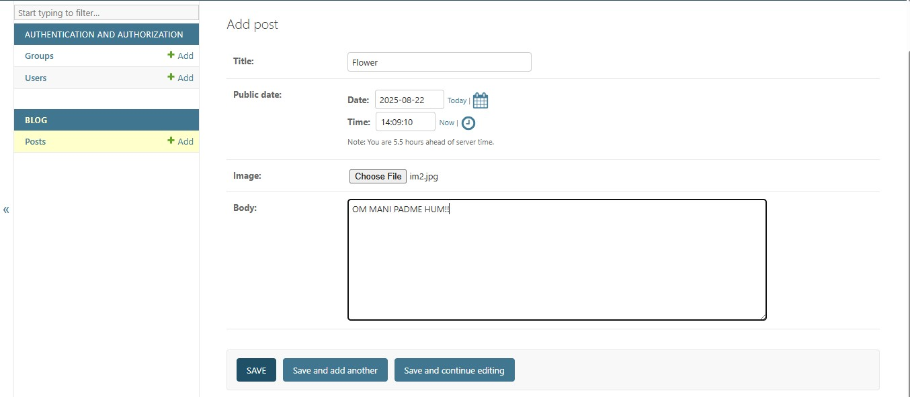
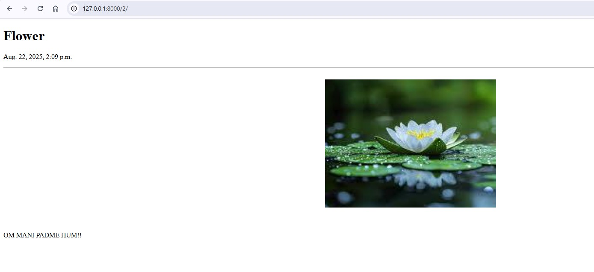
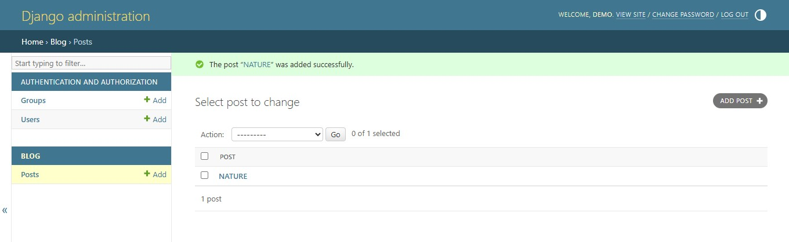
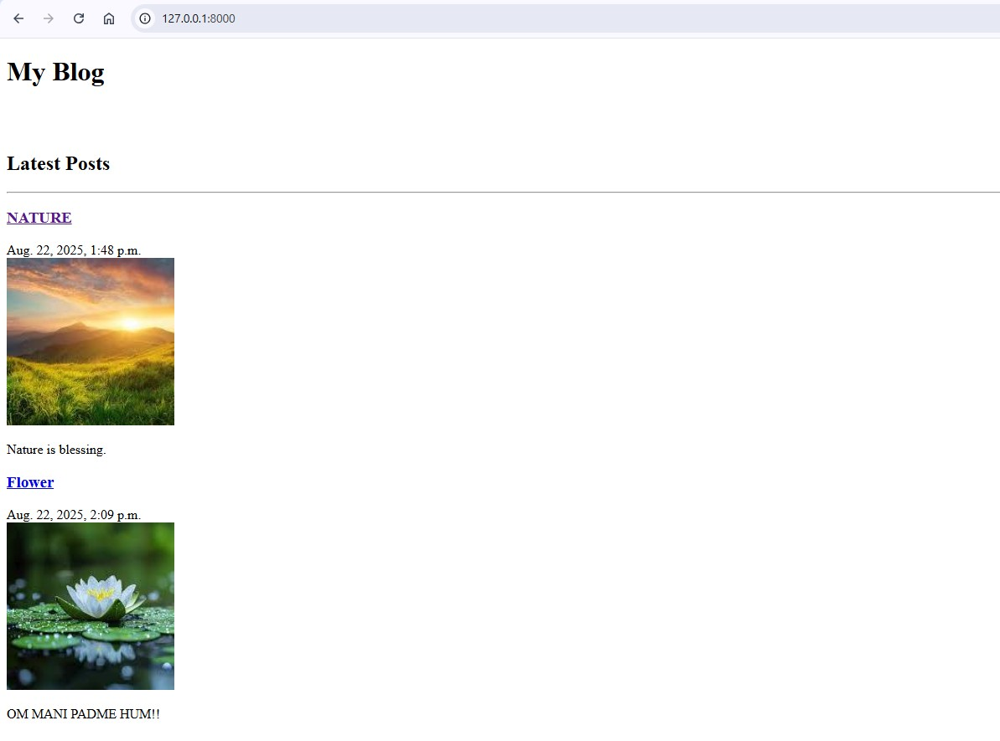

# Django Blog Project 📝

## 📌 Assignment 5  
**Module 14: Django - Blog Project**

This project demonstrates a simple Blog application built with Django.  
It includes functionalities for:
- Adding blog posts
- Viewing detailed blog posts
- Managing blogs via the Django Admin Panel
- Displaying all blogs in a user-friendly format

---

## 🚀 Features
- User-friendly interface
- Blog creation and management
- Django admin integration
- Organized blog detail pages

---

## 📷 Screenshots  

### 1️⃣ Adding a Blog Post  

### 2️⃣ Blog Detail Page  

### 3️⃣ Django Admin Page  

### 4️⃣ My Blog Page  

