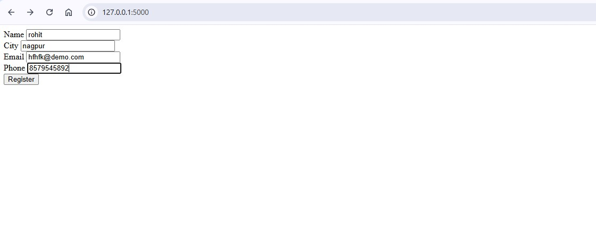
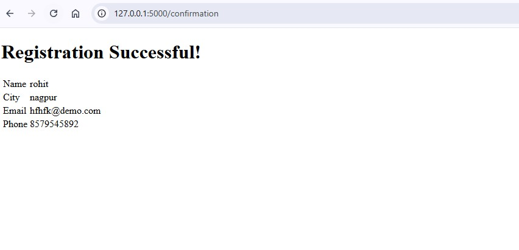

# ASSIGNMENT 6  
## Module 15: Flask - Registration Form Project  

### 📌 Description  
This project is a **Flask-based Registration Form** that allows users to register by entering their details, which are then displayed on a confirmation page.  

# 📷 Screenshots  

### 1️⃣ Registration Page  
  

### 2️⃣ Registration Form Filled  
  

### 3️⃣ Confirmation Page  
  

