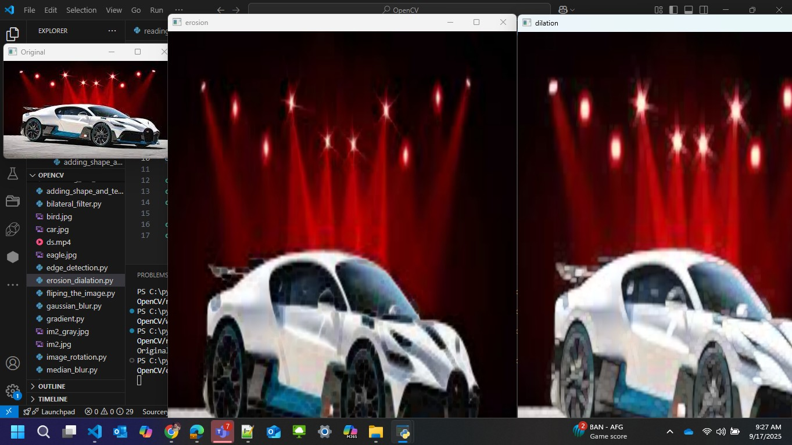

# Assignment 14: OpenCV Module Implementations  

## 📌 Module  
**Module 18 – OpenCV Implementation**  

---

## 📄 Description  
This assignment demonstrates **OpenCV implementations** by executing various image and video processing tasks.  
Each Python script is paired with its respective screenshot to validate the output.  
The screenshots include unedited system timestamps, executed code, and visible outputs to ensure authenticity.  

---

## 📂 Project Structure  

```plaintext
OpenCV/
│── reading_an_image.py
│── writing_an_image.py
│── resizing_an_image.py
│── erosion_dialation.py
│── opening_closing.py
│── gradient.py
│── tophat_blackhat.py
│── fliping_the_image.py
│── resizing_aspect_ration.py
│── adding_shape_and_text.py
│── shifting_an_image.py
│── image_rotation.py
│── Thresholding.py
│── gaussian_blur.py
│── median_blur.py
│── bilateral_filter.py
│── edge_detection.py
│── reading_an_video.py
│── writing_an_video.py
│── accessing_the_webcam.py
│
├── screenshots/   # Output screenshots
│   ├── reading_an_image.jpg
│   ├── writing_an_image.jpg
│   ├── im2_gray.jpg
│   ├── resizing_an_image.jpg
│   ├── erosion_dialation.jpg
│   ├── opening_closing.jpg
│   ├── gradient.jpg
│   ├── tophat_blackhat.jpg
│   ├── fliping_the_image.jpg
│   ├── fliping_the_image2.jpg
│   ├── resizing_aspect_ratio.jpg
│   ├── adding_shape_and_text.jpg
│   ├── shifting_an_image.jpg
│   ├── image_rotation.jpg
│   ├── Thresholding.jpg
│   ├── gaussian_blur.jpg
│   ├── median_blur.jpg
│   ├── bilateral_filter.jpg
│   ├── edge_detection.jpg
│   ├── reading_an_video.jpg
│   ├── writing_an_video.jpg
│   └── accessing_the_webcam.jpg
│
├── im2.jpg
├── bird.jpg
├── eagle.jpg
├── car.jpg
├── random.jpg
├── ds.mp4
└── output.mp4

'''

## Explanation of Files & Outputs & Screenshots  
### 1. Reading an Image

Reads an image using OpenCV and displays it in a new window.

  


### 2. Writing an Image (with Grayscale) 

Saves an image in different formats (original and grayscale).

  
  


### 3. Resizing an Image  

Resizes an image to new dimensions.


### 4. Erosion and Dilation  

Applies morphological operations: erosion and dilation.

 


### 5. Opening and Closing 

Demonstrates morphological opening and closing to remove noise.

  


### 6. Gradient Operation  

Computes morphological gradient (difference between dilation and erosion).

 


### 7. Top-Hat and Black-Hat  

Applies top-hat and black-hat morphological transformations.

 


### 8. Flipping the Image  

Flips the image horizontally and vertically.

  
 


### 9. Resizing with Aspect Ratio  

Resizes an image while maintaining aspect ratio.

  

### 10. Adding Shape and Text  

Draws shapes (rectangle, circle, line) and adds text on an image.

 
 

### 11. Shifting an Image  

Applies translation (shifting) of an image along x and y axes.

  


### 12. Image Rotation  

Rotates an image around its center.

  


### 13. Thresholding  

Applies image thresholding techniques (binary, adaptive, etc.).


  

### 14. Gaussian Blur  

Smoothens the image using Gaussian blur.

  


### 15. Median Blur 

Applies median blur filter for noise reduction.
 

  

### 16. Bilateral Filter  

Preserves edges while reducing noise using bilateral filtering.

  


### 17. Edge Detection  

Detects edges using Canny edge detection algorithm.

  


### 18. Reading a Video 

Reads and displays frames from a video file.

  


### 19. Writing a Video (with Output)  

Captures video and writes output to a new video file.

  


### 20. Accessing the Webcam 

Accesses the system webcam and displays live feed.

  


