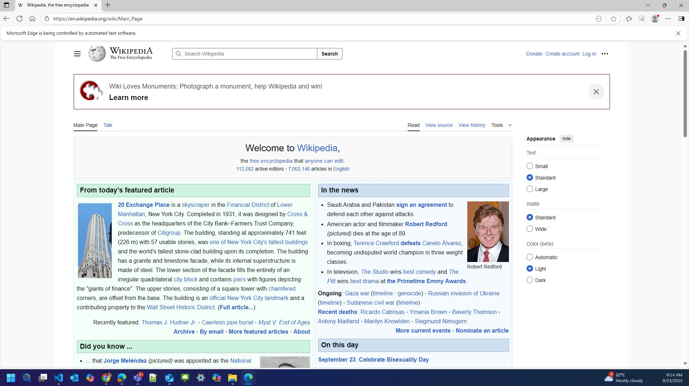
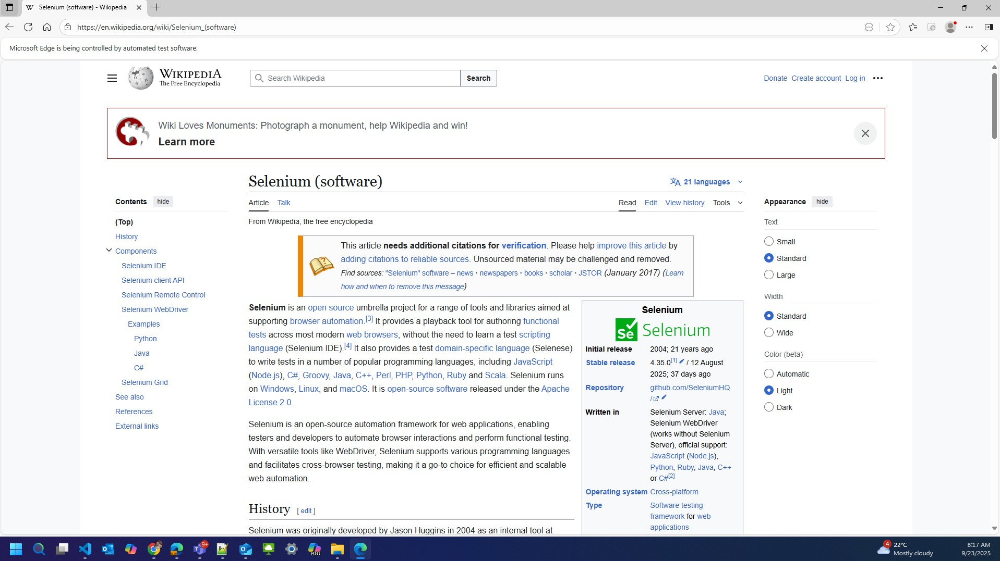
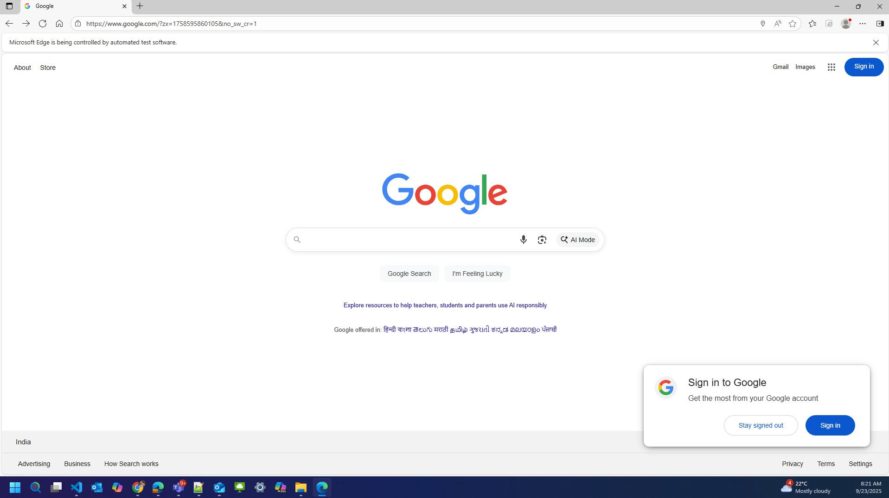
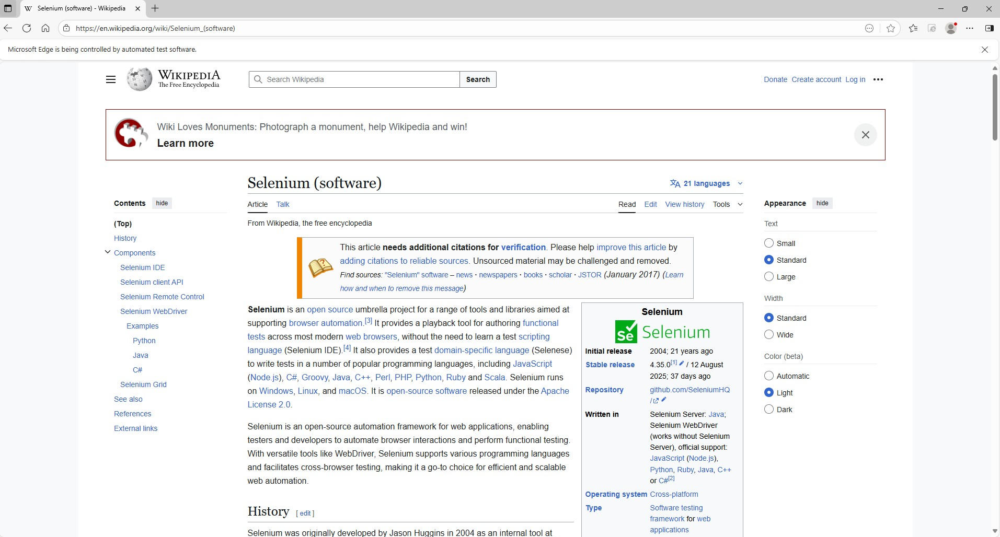
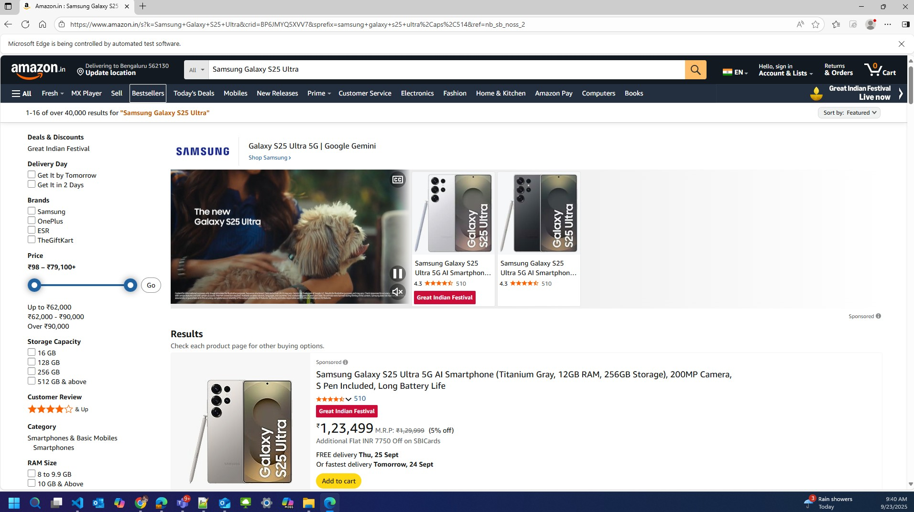
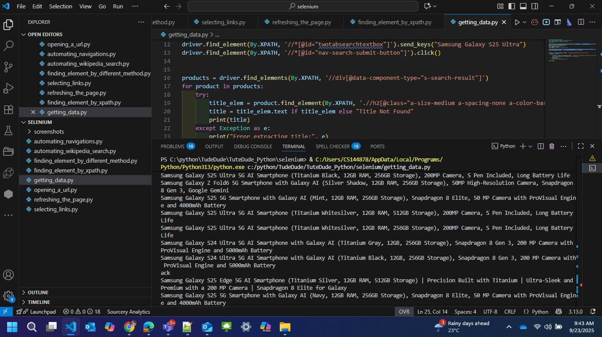

# Assignment 15: Automation using Selenium – Getting Data  

## 📌 Module  
**Module 19 – Automation using Selenium**  

---

## 📄 Description  
This assignment demonstrates **automation using Selenium** by performing various browser automation tasks such as navigation, searching, refreshing, selecting elements, and extracting data.  
Each Python script is paired with its respective screenshot to validate the output.  
The screenshots include unedited system timestamps, executed code, and visible outputs to ensure authenticity.  

---

## 📂 Project Structure  

```plaintext
Assignment15/
│── opening_a_url.py
│── automating_wikipedia_search.py
│── automating_navigations.py
│── finding_element_by_different_method.py
│── selecting_links.py
│── refreshing_the_page.py
│── finding_element_by_xpath.py
│── getting_data.py
│
├── screenshots/   # Output screenshots
│   ├── opening_a_url.jpg
│   ├── automating_wikipedia_search.jpg
│   ├── automating_navigations.jpg
│   ├── finding_element_by_different_method.jpg
│   ├── selecting_links.jpg
│   ├── refreshing_the_page.jpg
│   ├── finding_element_by_xpath.jpg
│   └── getting_data.jpg

``` 

## 📷 Explanation of Files & Outputs & Screenshots

### 1. Opening a URL

Launches a browser and opens a given URL using Selenium.



### 2. Automating Wikipedia Search

Performs a search query on Wikipedia automatically and retrieves results.



### 3. Automating Navigations

Automates browser navigation: back, forward, and refresh operations.



### 4. Finding Element by Different Methods

Locates elements on a webpage using different Selenium locators (ID, Name, Class, CSS, etc.).



### 5. Selecting Links

Selects and clicks hyperlinks on a webpage.


### 6. Refreshing the Page

Refreshes the browser window using Selenium commands.


### 7. Finding Element by XPath

Demonstrates how to locate elements using XPath expressions.



### 8. Getting Data

Extracts and retrieves data from a webpage automatically using Selenium.



