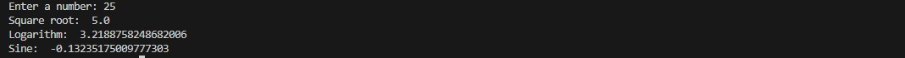

# TudeDude Assignment 3  
**Module 4: Functions & Modules in Python**

This repository contains solutions for **Assignment 3** of the TudeDude course.  
It demonstrates the use of **functions** and **Python’s built-in modules** to solve real problems.

---

## 📂 Repository Contents

- `Task1.py` → Python script to calculate factorial using a function  
- `Task2.py` → Python script to perform calculations using the `math` module  
- `screenshots/` → Folder containing output screenshots  
- `README.md` → Project documentation  

---

## 📝 Tasks Overview

### **Task 1: Calculate Factorial Using a Function**
**Problem Statement:**  
Write a Python program that:
1. Defines a function named `factorial` that takes a number as an argument.  
2. Calculates the factorial using either a loop or recursion.  
3. Returns the calculated factorial.  
4. Calls the function with a sample number and prints the result.  

**Expected Output Example:**
Enter a number: 5

Factorial of 5 is: 120

---

### **Task 2: Using the Math Module for Calculations**
**Problem Statement:**  
Write a Python program that:
1. Takes a number as input from the user.  
2. Uses the `math` module to calculate:
   - Square root  
   - Natural logarithm (base e)  
   - Sine (in radians)  
3. Displays the calculated results.  

**Expected Output Example:**

Enter a number: 25

Square Root: 5.0

Natural Logarithm: 3.2188758248682006

Sine: -0.13235175009777303

## 🖼️ Screenshots / Output Images

### Task 1 Output

### Task 2 Output

