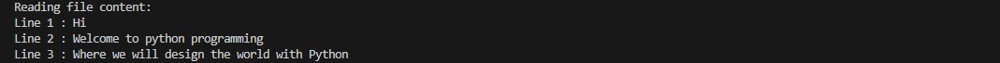
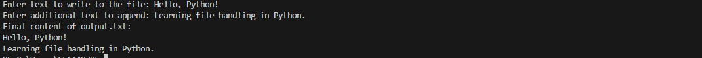

# TudeDude Assignment 4  
**Module 5: Files, Exceptions, and Errors in Python**

This repository contains solutions for **Assignment 4** of the TudeDude course.  
It demonstrates how to work with **files** and handle **errors/exceptions** gracefully in Python.

---

## 📂 Repository Contents

- `task1.py` → Python script to read a file and handle errors  
- `task2.py` → Python script to write, append, and read from a file  
- `sample.txt` → Sample input file used in Task 1   
- `screenshots/` → Folder containing program output screenshots  
- `README.md` → Project documentation  

---

## 📝 Tasks Overview

### **Task 1: Read a File and Handle Errors**
**Problem Statement:**  
Write a Python program that:
1. Opens and reads a file named `sample.txt`.  
2. Prints its content line by line.  
3. Handles errors gracefully if the file does not exist.  

**Expected Output Example:**  
- If the file exists:

Reading file content...
Line 1: This is a sample line.
Line 2: Python is fun!

---

### **Task 2: Write and Append Data to a File**
**Problem Statement:**  
Write a Python program that:
1. Takes user input and writes it to a file named `output.txt`.  
2. Appends additional data to the same file.  
3. Reads and displays the final content of the file.  

**Expected Output Example:**

Enter some text: Learning Python
Enter more text to append: with TudeDude

Final content of output.txt:
Learning Python
with TudeDude

---

## 🖼️ Screenshots / Output Images

### Task 1 Output

### Task 2 Output

