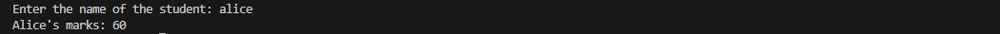
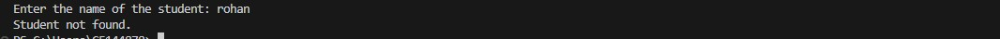
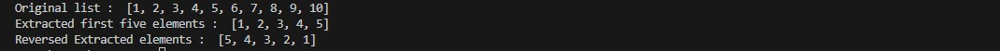

# TudeDude Assignment 5  
**Module 6: Data Structures and Strings in Python**

This repository contains solutions for **Assignment 5** of the TudeDude course.  
It focuses on working with **Python dictionaries, lists, and string manipulation**.

---

## 📂 Repository Contents

- `task1.py` → Python script to create and query a dictionary of student marks  
- `task2.py` → Python script to demonstrate list slicing and reversing  
- `screenshots/` → Folder containing program output screenshots  
- `README.md` → Project documentation  

---

## 📝 Tasks Overview

### **Task 1: Create a Dictionary of Student Marks**
**Problem Statement:**  
Write a Python program that:
1. Creates a dictionary where student names are keys and their marks are values.  
2. Asks the user to input a student’s name.  
3. Retrieves and displays the corresponding marks.  
4. If the student’s name is not found, displays an appropriate message.  

**Expected Output Example:**  
- If the student exists:

Enter student name: John

Marks of John: 85


- If the student does not exist:

Enter student name: Alex

Error: Student not found in the dictionary.


---

### **Task 2: Demonstrate List Slicing**
**Problem Statement:**  
Write a Python program that:
1. Creates a list of numbers from 1 to 10.  
2. Extracts the first five elements from the list.  
3. Reverses these extracted elements.  
4. Prints both the extracted list and the reversed list.  

**Expected Output Example:**

Original List: [1, 2, 3, 4, 5, 6, 7, 8, 9, 10]

Extracted First 5 Elements: [1, 2, 3, 4, 5]

Reversed Extracted List: [5, 4, 3, 2, 1]


--- 

```markdown
## 🖼️ Screenshots / Output Images

### Task 1: Student Found in Dictionary


### Task 1: Student Not Found in Dictionary


### Task 2: List Slicing and Reversing

