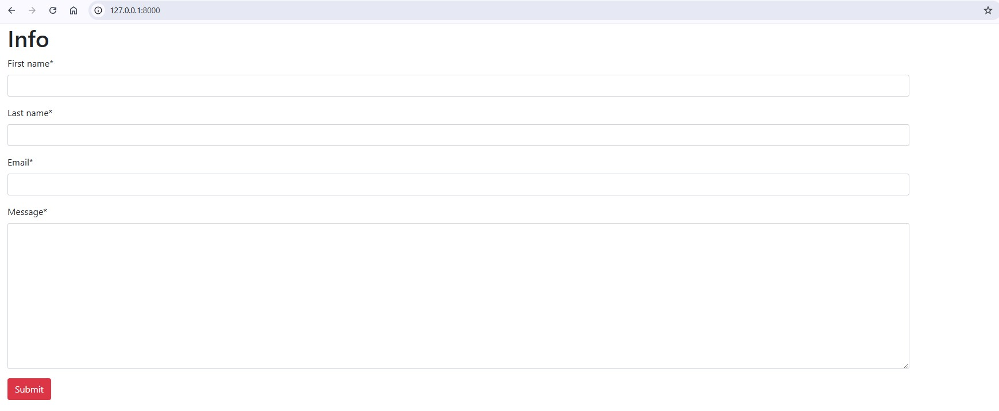

# 📘 Assignment 4: Django Form Project

This project is part of **Module 14** of the Python course (Lectures 19–21).  
The objective of this assignment is to build a **Django project with Form handling**.

---

## 📌 Project Description

This Django project demonstrates the use of **Forms** in a web application.  
It includes:

- Setting up a Django app  
- Creating and rendering forms  
- Handling user input through GET/POST requests  
- Validating form data  
- Displaying results back to the user  

---

## ⚙️ How to Run the Project

1. **Clone or Download the Project**  
   Extract the zip file to your local machine.

2. **Navigate into the project folder**  
   ```bash
   cd web

3. **Install dependencies
	It’s recommended to use a virtual environment. Then install Django:

	pip install django


4. **Run the development server

	python manage.py runserver


5. **Open in browser
	Visit http://127.0.0.1:8000
	to access the project.
	


📸 Screenshots


## Login Page


